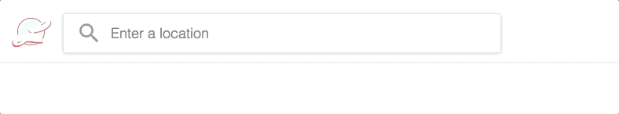
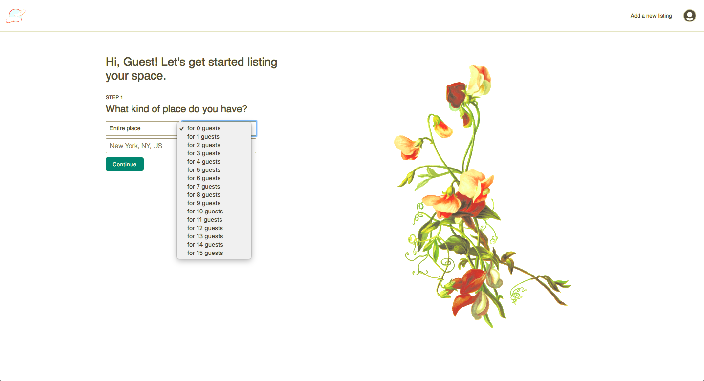

# Lets!

<!-- Elevator pitch -->

Inspired by AirBnB, *Lets!* is a web application for connecting people who need space to people who have some to spare.

This application was built with Ruby on Rails, React/Redux, and the Places Library in the Google Maps JavaScript API.

## Features & Implementation

### Spot Rendering and Creation

At their most basic, Spots are stored in the database in a table with `lat` and `lng` tables to identify their locations. These values are used to populate a map as well as the spot-listings grid which together makeup the app's main user-interface:

Once the User has used the session modal to either log in or sign up, they're immediately presented with the map and grid UI beneath a search bar enabled with autocomplete via Google Places API.

The User can filter the Spots listed in the grid by changing the position of the map--either by dragging/panning it, or by adjusting the zoom-level.

They can also use the the search bar. With each change to the User's search query, the current most-likely predictions are dynamically parsed to provide a large pool of potential values to match against the existing Spots stored in the Lets! database. As the User input gets more specific, the pool of values self-filters to decrease granularity.

To create a new Spot listing and become a Letter (host), a User is given a series of nine pages each presenting a new set of relevant input prompts. The values from these inputs are stored in the local state of the NewSpotForm component, which serves as a switch-relay for the individual pages, until the last form is completed and the values are split into two parts.

One group of values, the top-level details like `lat`/`long`, `spotType` ('Entire House', etc.), and `maxOccupancy`, are passed to the `createSpot` method, while the others (mostly `boolean` values indicating the availability of individual amenities like `outdoorArea`, `tv`, `internet`, and `parking`) are used to create a new entry in the `spot_details` table.

The finishing touch in this process is retrieving the newly minted `spotId` which has been assigned to the `ui` slice of state. This id is provided as the foreign key for the spot_details table and is also referenced by `react-router-dom` `Route` to render the individual show page of the new Spot.

<!-- Features & Implementation
Describe backend/db/schema of primary components.
Describe basic functionality.
Describe UI of components and app as whole
-->
